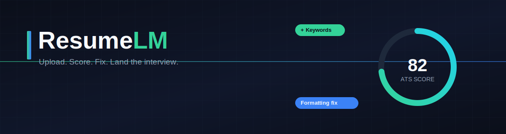
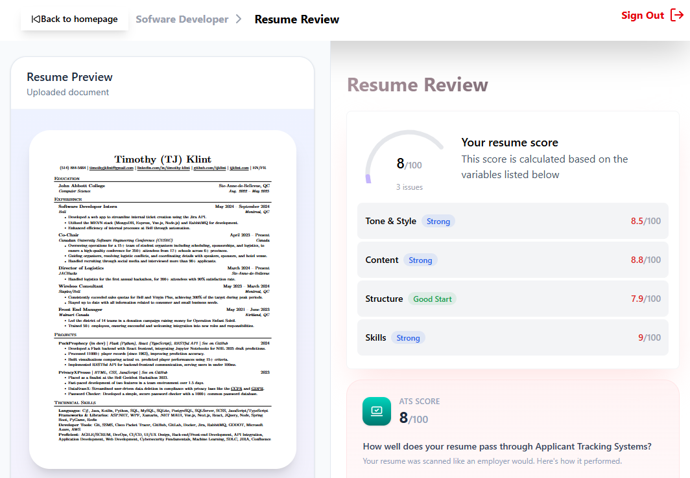

<div align="center">




### Your resume, audited like code.

[](https://nextjs.org)
[](https://www.typescriptlang.org)
[](https://prisma.io)
[](https://supabase.com)
[](https://better-auth.com)
[](https://zustand-demo.pmnd.rs)
[]()

</div>

---

## The problem

Most resumes never get read by a human. They get filtered by an ATS, skimmed for eight seconds, or quietly ranked below a hundred others — and nobody tells you why. **ResumeLM is the diagnostic step that happens before you hit "Apply."**

Upload a resume. Get back a score, a list of concrete issues, and a feedback report you can actually act on — not a vague "looks good!" from a friend who didn't really read it.

## How it works

```
  upload          parse              score              fix
┌─────────┐    ┌──────────┐    ┌─────────────────┐    ┌──────────┐
│  .pdf   │ →  │ extract  │ →  │ ATS + Job Fit    │ →  │ targeted │
│  .docx  │    │  content │    │ scoring engine   │    │ feedback │
└─────────┘    └──────────┘    └─────────────────┘    └──────────┘
```

1. **Upload** your resume (PDF or Word)
2. ResumeLM parses structure, content, and formatting
3. It's scored against ATS-readability rules and, optionally, a specific job description
4. You get an itemized breakdown: what's hurting your score, what's missing, and what to fix first

## What you actually get back

| Output                 | What it tells you                                                                         |
| ---------------------- | ----------------------------------------------------------------------------------------- |
| **ATS Score**          | A single number reflecting how cleanly an applicant tracking system can parse your resume |
| **Issue list**         | Specific, line-level problems — not generic advice                                        |
| **Job Fit Score**      | How well your resume matches a _specific_ job description, when you provide one           |
| **Missing keywords**   | Terms the job description expects that your resume doesn't have                           |
| **Matching strengths** | What's already working, so you know what to keep                                          |

No fluff scoring, no "9/10 great job!" — if something's broken, ResumeLM says so.

## 🔜 Coming soon: Cover Letter Generation

The next piece of the pipeline. Once your resume is scoring well, ResumeLM will generate a **tailored cover letter** that:

- Pulls directly from your scored resume — no rewriting your story from scratch
- Aligns tone and keywords to the specific job description you're targeting
- Comes back editable, not a black-box wall of text you have to untangle

This isn't on by default yet — it's actively in development and will ship as a natural extension of the existing scoring engine, not a bolted-on feature.

## Stack

- **Framework** — Next.js (App Router, Server Actions)
- **Language** — TypeScript
- **Auth** — Better Auth, email/password with verification
- **Database** — PostgreSQL via Supabase, accessed through Prisma 7 with driver
  adapters
- **API** — Groq API
- **State management** — Zustand
- **Hosting** — Vercel

## Getting started

```bash
git clone https://github.com/your-username/resume-lm.git
cd resume-lm
npm install
```

Create a `.env` with your database and mail credentials:

```dotenv
DATABASE_URL="postgresql://<user>:<password>@<pooler-host>:6543/postgres?pgbouncer=true&connection_limit=1"
NEXT_PUBLIC_APP_URL="http://localhost:3000"
EMAIL_FROM="noreply@yourdomain.com"
```

Generate the Prisma client and run migrations:

```bash
npx prisma generate
npx prisma migrate dev
```

Start the dev server:

```bash
npm run dev
```

## Roadmap

- [x] Resume upload + parsing
- [x] ATS scoring engine
- [x] Job-description-aware fit scoring
- [x] Email/password auth with verification
- [ ] Cover letter generation
- [ ] Resume version history
- [ ] Export annotated PDF report

---

<div align="center">
<sub>Built for people tired of guessing why their resume isn't working.</sub>
</div>
